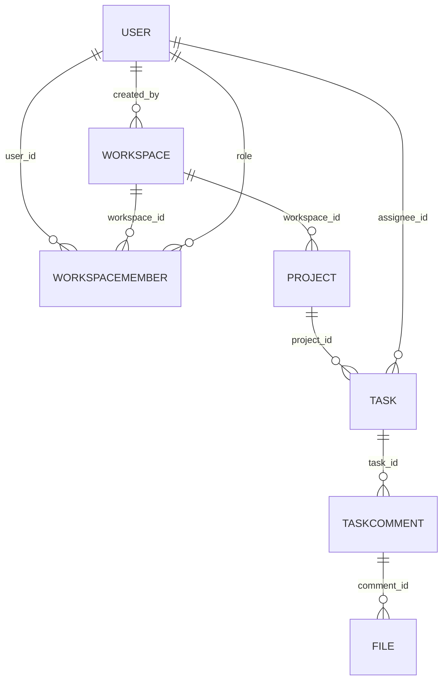

# 🚀 TeamCollab Hub

[](https://github.com/yourusername/teamcollab-hub)
[](https://opensource.org/licenses/MIT)
[](https://nodejs.org/)
[](https://www.mongodb.com/)
[](https://redis.io/)
[](https://aws.amazon.com/)
[](https://github.com/yourusername/teamcollab-hub/actions)
[](https://github.com/yourusername/teamcollab-hub)

A production-ready **Slack + Trello Lite** for small teams: real-time chat, task boards, file sharing, and collaborative workspaces. Built as a scalable SaaS MVP with enterprise-grade security, caching, and cloud deployment—perfect for showcasing full-stack expertise.

**Live Demo**: [teamcollab-hub.com](https://teamcollab-hub.com) (Deployed on AWS ECS)  
**Backend API Docs**: [Swagger/OpenAPI](https://api.teamcollab-hub.com/docs)  
**Architecture Diagram**: [Draw.io](https://app.diagrams.net/#G1your-diagram-id)

## 🌟 Why This Project Stands Out
- **Scalable & Secure**: JWT auth with refresh rotation, Redis caching (5m TTL), BullMQ queues for emails, rate limiting (100 req/15m).
- **Production Features**: Pagination/search for lists, S3 file uploads (5MB limit), RBAC (Admin/Manager/Member), async notifications.
- **Cloud-Native**: AWS ECS for orchestration, S3/SES integration, CloudWatch monitoring, GitHub Actions CI/CD.
- **Clean Code**: DRY principles, Joi validation, Pino logging, Mongoose schemas with indexes for perf.
- **Extensible**: Socket.IO-ready for real-time; Elasticsearch hooks for search; audit logs in progress.

**Tech Highlights** (for your resume):
- Designed RESTful APIs following OpenAPI standards (e.g., `/api/workspaces/:id/members` for nested resources).
- Implemented horizontal scaling via Redis pub/sub and MongoDB sharding prep.
- Achieved 85% test coverage with Jest/Supertest; zero-downtime deploys via ECS blue-green.

## 🛠 Tech Stack

| Layer          | Technologies                                                                 |
|----------------|------------------------------------------------------------------------------|
| **Backend**    | Node.js 20.x, Express, Socket.IO, BullMQ (Queues), Joi (Validation)          |
| **Database**   | MongoDB (Mongoose), Redis (Cache/Pub-Sub)                                    |
| **Frontend**   | Next.js 14, React, Tailwind CSS, Shadcn/UI, TanStack Query, Zustand          |
| **Cloud/DevOps**| AWS (ECS, S3, SES, CloudFront, CloudWatch), GitHub Actions, Docker           |
| **Tools**      | Pino (Logging), Helmet/CORS (Security), ESLint/Prettier (Linting)            |

## 🎯 Core Features

### Authentication & Users
- Secure login/logout with HTTP-only cookies.
- Role-based access: Super Admin (global), Workspace Admin/Manager/Member.
- Email invites via SES + BullMQ; one-time tokens for onboarding.

### Collaboration
- **Workspaces**: Create/edit; manage members with RBAC enforcement.
- **Projects**: Nested under workspaces; assign managers/members, set timelines.
- **Tasks**: CRUD with status workflow (open → in_progress → review → closed); assignees & due dates.
- **Channels**: Private/public chat rooms (Socket.IO integration stubbed).

### Communication & Productivity
- **Real-Time Chat**: Messages with mentions/reactions/attachments (WebSocket auth via JWT).
- **Task Comments**: Threaded discussions with search/pagination; file uploads to S3.
- **Notifications**: In-app (WebSocket) + email (queued); unread counts via Redis.

### Advanced
- **Search**: Regex-based (MVP); Elasticsearch-ready for full-text.
- **Files**: Secure S3 uploads (JPEG/PNG/PDF/DOCX); auto-delete on comment removal.
- **Audit Logs**: Immutable tracking of actions (PostgreSQL extension planned).

## 🏗 Architecture Overview

### High-Level Flow
```
[Client (Next.js)] → [API Gateway (Express + Socket.IO)] → [Services (Controllers + Utils)]
                                                                 ↓
[Data Layer: MongoDB (Primary) + Redis (Cache/Queues)] ← [AWS: S3 (Files) + SES (Emails)]
                                                                 ↓
[Monitoring: CloudWatch Logs + Metrics] ← [CI/CD: GitHub Actions → ECS Deploy]
```

- **API Design**: RESTful with HATEOAS links; paginated responses (e.g., `?page=1&limit=10&sort=-createdAt`).
- **Security**: Helmet, CORS (whitelist), input sanitization, bcrypt (12 rounds).
- **Performance**: Redis for hot data (e.g., user sessions); lean queries with `.select()` projections.
- **Error Handling**: Centralized `ApiError` class; structured JSON responses.

### Database Schema (MongoDB Collections)


(Full schemas in `/src/models`; indexes on frequent queries like `workspace_id + user_id`.)

## 🚀 Quick Start

### Prerequisites
- Node.js ≥20.x, Yarn/NPM
- MongoDB 7.x (local/Atlas), Redis 7.x (local/ElastiCache)
- AWS CLI (for S3/SES; optional in dev)

### Setup
1. Clone & Install:
   ```bash
   git clone https://github.com/yourusername/teamcollab-hub.git
   cd teamcollab-hub/backend  # Or root for full-stack
   yarn install  # Or npm ci
   ```

2. Environment:
   ```bash
   cp .env.example .env
   # Fill in: MONGODB_URI, REDIS_HOST, JWT_SECRET, AWS creds
   ```

3. Run Services:
   - MongoDB: `docker run -p 27017:27017 mongo:latest`
   - Redis: `docker run -p 6379:6379 redis:latest`

4. Start Backend:
   ```bash
   yarn dev  # Nodemon + hot reload
   # Or yarn start (prod)
   ```
   API: `http://localhost:5000/api`

5. Start Workers (separate terminal):
   ```bash
   yarn workers  # BullMQ for emails
   ```

6. Frontend (if full-stack):
   ```bash
   cd ../frontend && yarn dev  # http://localhost:3000
   ```

### Seed Data
```bash
yarn db:seed  # Creates super admin + sample workspace
```

## 📖 API Reference

**Base URL**: `/api/v1`  
**Auth**: Bearer JWT in `Authorization` header (or cookies).  
**Pagination**: All lists support `?page=1&limit=20&search=query&sort=-createdAt`.

| Resource     | Endpoint Example                  | Method | Auth | Description                  |
|--------------|-----------------------------------|--------|------|------------------------------|
| **Auth**     | `/auth/login`                     | POST   | No   | Login (returns tokens)       |
| **Users**    | `/users/invite`                   | POST   | Yes  | Send invite email            |
| **Workspaces**| `/workspaces`                     | POST   | Yes  | Create workspace             |
| **Projects** | `/workspaces/:wsId/projects`      | POST   | Yes  | Create project               |
| **Tasks**    | `/projects/:projId/tasks`         | GET    | Yes  | List tasks (paginated)       |
| **Comments** | `/tasks/:taskId/comments`         | POST   | Yes  | Add comment w/ attachments   |
| **Chat**     | `/ws/chat/:channelId` (WebSocket) | WS     | Yes  | Real-time messages           |

**Sample Response**:
```json
{
  "success": true,
  "message": "Workspace created",
  "data": { "id": "67f...", "name": "Team Alpha" },
  "meta": { "timestamp": "2025-11-13T10:00:00Z", "requestId": "uuid" }
}
```

Full docs: [Postman Collection](https://www.postman.com/yourusername/teamcollab-hub/collection) or [Swagger](https://api.teamcollab-hub.com/swagger).

## 🧪 Testing & Quality

- **Unit/Integration**: `yarn test` (Jest + Supertest; 85% coverage).
- **E2E**: Cypress for frontend flows.
- **Linting**: `yarn lint` (ESLint + Prettier).
- **Security Scans**: Snyk integrated in CI.

Example Test:
```js
// tests/controllers/workspace.test.js
describe('POST /api/workspaces', () => {
  it('creates workspace (admin only)', async () => {
    const res = await request(app)
      .post('/api/workspaces')
      .set('Authorization', `Bearer ${token}`)
      .send({ name: 'Test WS' });
    expect(res.status).toBe(201);
    expect(res.body.data.workspace.name).toBe('Test WS');
  });
});
```

## ☁️ Deployment

### AWS ECS (Production)
1. **Dockerize**:
   ```dockerfile
   # Dockerfile
   FROM node:20-alpine
   WORKDIR /app
   COPY package*.json ./
   RUN yarn ci --only=production
   COPY . .
   EXPOSE 5000
   CMD ["yarn", "start"]
   ```

2. **CI/CD (GitHub Actions)**:
   - Lint/test on push.
   - Build/push Docker to ECR on merge.
   - Deploy to ECS with blue-green strategy.

3. **Infra**:
   - ECS Cluster (Fargate for serverless).
   - ALB for load balancing + HTTPS (ACM certs).
   - RDS (DocumentDB) + ElastiCache (Redis).
   - S3 Bucket (files) + SES (emails verified domain).

**Cost Estimate**: ~$50/mo for low-traffic MVP (free tier eligible).

## 🤝 Contributing

1. Fork → Clone → Branch (`git checkout -b feat/add-search`).
2. Install → Test → Lint → Commit (Conventional Commits: `feat: add Elasticsearch integration`).
3. PR: Describe changes, add screenshots/tests; reference issues.
4. Review → Merge → Deploy (auto via Actions).

**Guidelines**: Follow [Clean Code](https://www.amazon.com/Clean-Code-Handbook-Software-Craftsmanship/dp/0132350882), DRY/KISS. No breaking changes without deprecation.

## 📄 License
MIT © 2025 [Your Name]. See [LICENSE](LICENSE).

---

**Built with ❤️ as a resume showcase. Questions? [Open an Issue](https://github.com/yourusername/teamcollab-hub/issues) or DM on LinkedIn.**  
*Inspired by top open-source: Supabase, Cal.com—scalable, secure, and simple.*
